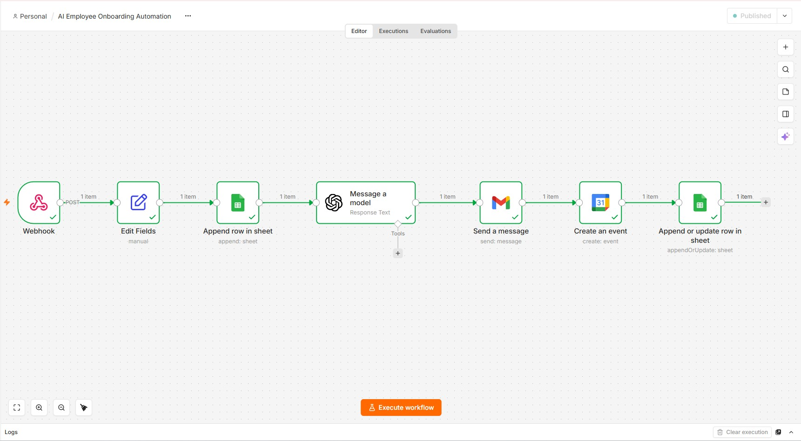
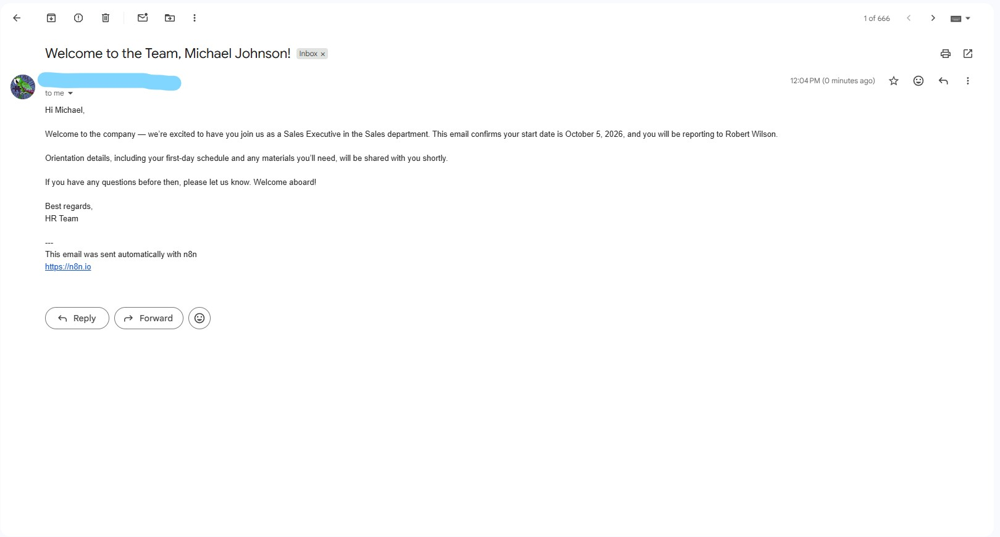
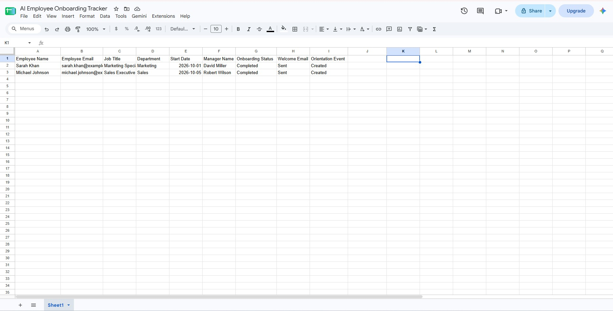
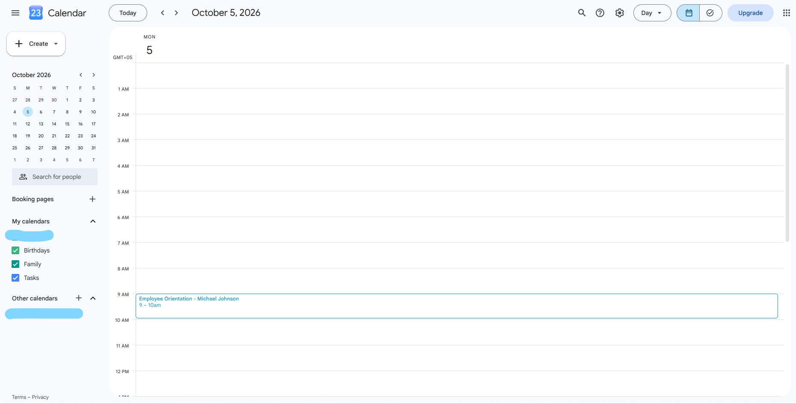

# AI Employee Onboarding Automation

An end-to-end AI-powered employee onboarding workflow built with n8n, GPT-5-mini, Google Sheets, Gmail, and Google Calendar.

## Overview

This automation streamlines the employee onboarding process from a single webhook request.

When a new employee is submitted, the workflow automatically:

- Captures employee information through a webhook
- Adds the employee to a Google Sheets onboarding tracker
- Uses GPT-5-mini to generate a personalized welcome email
- Sends the welcome email through Gmail
- Creates an employee orientation event in Google Calendar
- Updates the onboarding tracker when the process is completed

## Workflow

Webhook → Edit Fields → Google Sheets → GPT-5-mini → Gmail → Google Calendar → Google Sheets Update

## Key Features

- Automated employee data collection
- AI-generated personalized welcome emails
- Automated Gmail delivery
- Google Calendar orientation scheduling
- Employee onboarding status tracking
- End-to-end workflow automation
- Automated completion status updates

## Tools & Technologies

- n8n
- OpenAI GPT-5-mini
- Google Sheets
- Gmail
- Google Calendar
- Webhooks

## Workflow Preview

## AI Welcome Email

## Employee Onboarding Tracker

## Orientation Event

## Use Case

This automation can help HR teams and businesses reduce repetitive onboarding tasks, maintain consistent employee records, send personalized welcome communications, and automatically schedule orientation sessions.

## Project Status

Completed and successfully tested end-to-end.
